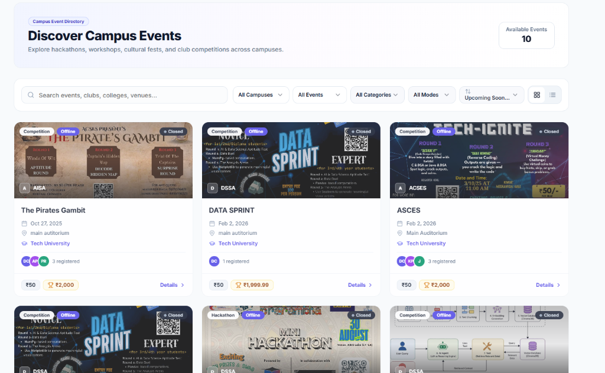
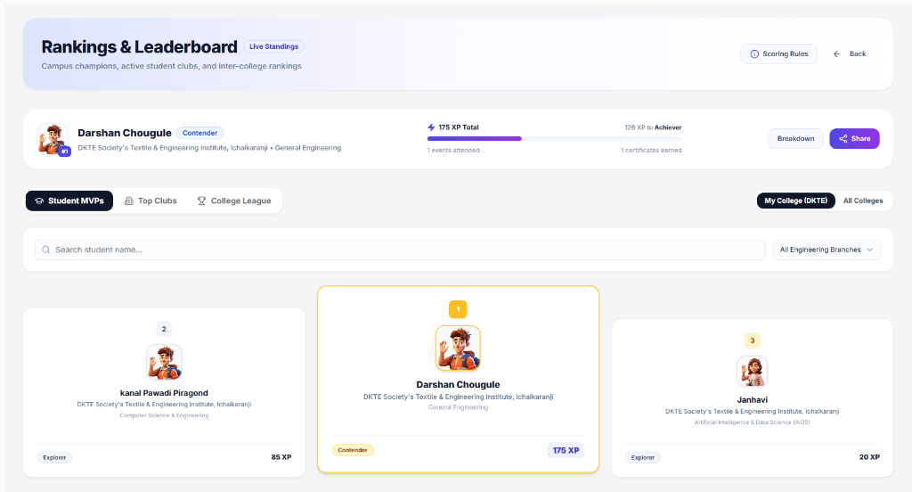
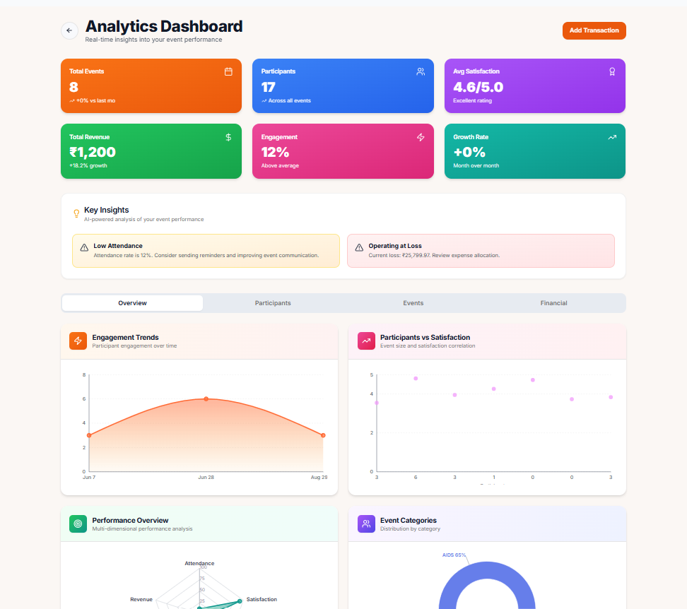
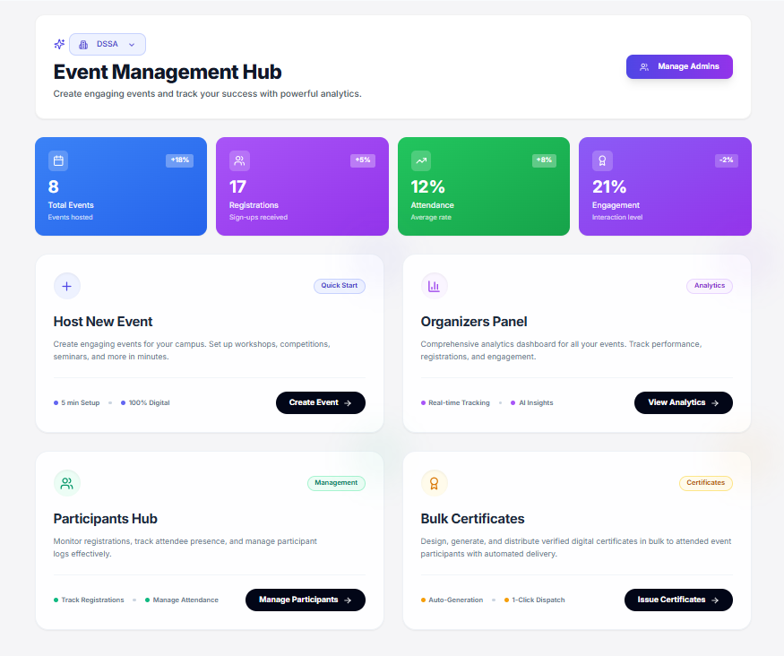
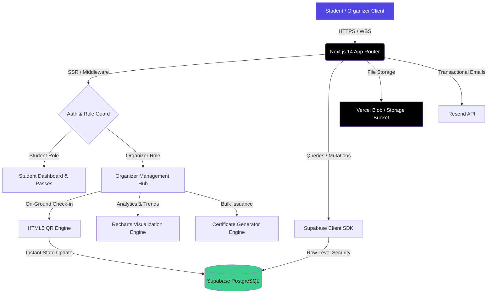

<div align="center">

  

  # 🎓 Clunite
  ### The Unified Campus Event, Club & Participant Intelligence Platform

  <p>
    <b>One platform for event discovery, live check-ins, financial tracking, and verified certificates.</b><br/>
    Built for student communities that outgrow spreadsheets and WhatsApp groups.
  </p>

  [](https://nextjs.org/)
  [](https://www.typescriptlang.org/)
  [](https://reactjs.org/)
  [](https://tailwindcss.com/)
  [](https://supabase.com/)
  [](https://render.com/)
  [](./LICENSE)
  [](./CONTRIBUTING.md)

  <p align="center">
    <a href="#-key-features"><b>Features</b></a> •
    <a href="#-live-demo--screenshots"><b>Screenshots</b></a> •
    <a href="#-system-architecture"><b>Architecture</b></a> •
    <a href="#-quick-start"><b>Quick Start</b></a> •
    <a href="#-tech-stack"><b>Tech Stack</b></a> •
    <a href="#-roadmap"><b>Roadmap</b></a> •
    <a href="#-contributing"><b>Contributing</b></a>
  </p>

</div>

---

## 🌟 Overview

**Clunite** is a full-stack campus management ecosystem built to eliminate friction in student life. It connects students to campus activities while giving club organizers an enterprise-grade operating system to host events, track live turnouts, manage finances, issue verified digital certificates, and analyze engagement with AI-powered insights.

Whether you're a student discovering workshops or an organizer managing a 500+ participant hackathon with on-ground QR check-ins, **Clunite** handles the entire lifecycle with speed, reliability, and precision.

---

## 🖼️ Live Demo & Screenshots

<div align="center">

### 🔍 Discover Campus Events
*Explore, filter, and register for hackathons, competitions, and workshops with instant search.*
<br/>


<br/><br/>

<table>
  <tr>
    <td width="50%" align="center">
      <b>🏆 Rankings & Leaderboard</b><br/>
      <sub>Live XP standings, student MVPs, and tier progressions</sub><br/><br/>
      
    </td>
    <td width="50%" align="center">
      <b>📊 Analytics Dashboard</b><br/>
      <sub>Real-time engagement trends, finances, and AI insights</sub><br/><br/>
      
    </td>
  </tr>
</table>

<br/>

### 🎪 Event Management Hub
*Create events, monitor registrations, launch QR scanners, and dispatch bulk certificates in one view.*
<br/>


</div>

---

## 🚀 Key Features

<table>
  <tr>
    <td width="50%" valign="top">
      <h3>🎓 For Students</h3>
      <ul>
        <li><b>Dynamic Event Discovery:</b> Search and filter by category, college, mode (Online/Offline), and dates.</li>
        <li><b>1-Click Registration:</b> Individual and multi-member team registrations with custom question forms.</li>
        <li><b>Live Digital QR Passes:</b> Mobile-accessible ticket passes for swift on-ground event entry.</li>
        <li><b>Gamified XP & Rank Tiers:</b> Earn XP for participating, climb leaderboards, and unlock milestone tier badges.</li>
        <li><b>Verified Digital Certificates:</b> Automated certificate generation and immediate PDF downloads.</li>
        <li><b>Club Hub:</b> Explore active student clubs, view leadership rosters, and apply for memberships.</li>
      </ul>
    </td>
    <td width="50%" valign="top">
      <h3>🎪 For Club Organizers</h3>
      <ul>
        <li><b>Event Management Hub:</b> Rich markdown editor, banner uploads, ticket tiers, and capacity control.</li>
        <li><b>Live Turnout Control:</b> Real-time participant tracker with status filters (Registered, Attended, Waitlisted, Cancelled).</li>
        <li><b>On-Ground QR Scanner:</b> Built-in scanner with audio haptic feedback for lightning-fast check-ins.</li>
        <li><b>Deep Analytics & Demographics:</b> Visual breakdown by department, academic year, and attendance ratios.</li>
        <li><b>Financial Intelligence:</b> Track event income, operational expenses, profit margins, and vendor receipts.</li>
        <li><b>Automated Bulk Certificates:</b> 1-click issuance and email delivery to verified attendees.</li>
      </ul>
    </td>
  </tr>
</table>

---

## 🏗️ System Architecture

Clunite runs on **Next.js 14 App Router** paired with **Supabase PostgreSQL** and **Row-Level Security (RLS)** policies for high concurrency and strict data isolation.



---

## 🧰 Tech Stack

<div align="center">

| Layer | Technologies |
|---|---|
| **Frontend Framework** | [Next.js 14 (App Router)](https://nextjs.org/), [React 18](https://reactjs.org/) |
| **Language & Typing** | [TypeScript 5.9](https://www.typescriptlang.org/) (Strict Type Checking) |
| **Styling & UI Design** | [Tailwind CSS 3.4](https://tailwindcss.com/), [shadcn/ui](https://ui.shadcn.com/), [Radix UI Primitives](https://www.radix-ui.com/) |
| **Animations & 3D** | [Framer Motion](https://www.framer.com/motion/), [Three.js](https://threejs.org/), [React Three Fiber](https://r3f.docs.pmnd.rs/) |
| **Data Visualization** | [Recharts](https://recharts.org/) |
| **Backend & Database** | [Supabase](https://supabase.com/) ([PostgreSQL](https://www.postgresql.org/), Auth SSR, RLS Policies) |
| **Forms & Validation** | [React Hook Form](https://react-hook-form.com/), [Zod](https://zod.dev/) |
| **Media & Storage** | [Vercel Blob Storage](https://vercel.com/docs/storage/vercel-blob) |
| **Cloud Hosting** | [Render](https://render.com/) (Web Service), [Vercel](https://vercel.com/) |
| **Email & Notifications** | [Resend](https://resend.com/), [Sonner Toasts](https://sonner.emilkowal.ski/) |
| **Package Manager** | [pnpm](https://pnpm.io/) |

</div>

---

## 📁 Project Directory Structure

<details>
<summary><b>Click to expand full directory tree</b></summary>

```plaintext
Official-Clunite/
├── app/                              # Next.js 14 App Router Directory
│   ├── api/                          # Next.js Backend Route Handlers
│   ├── auth/                         # Authentication Flows (Login, Signup, Verify)
│   ├── dashboard/
│   │   ├── student/                  # Student Experience (Browse, Rank, QR, Certificates)
│   │   └── organizer/                # Organizer Experience (Host, Events, Analytics, Admins)
│   ├── globals.css                   # Tailwind Base & Theme Tokens
│   ├── layout.tsx                    # Root Layout & Theme Providers
│   └── page.tsx                      # High-Conversion Landing Page
├── components/                       # Shared & Reusable Components
│   ├── analytics/                    # Chart Components (Modern, Demographic, Financial)
│   ├── certificates/                 # Certificate Templates & Download Handlers
│   ├── ui/                           # shadcn/ui Core Component Primitives
│   ├── app-sidebar.tsx               # Responsive Collapsible Drawer / Sidebar
│   └── dashboard-header.tsx          # Universal Dashboard Navigation Bar
├── docs/                             # Architecture & Setup Documentation
├── hooks/                            # Custom React Data & Real-time Hooks
├── lib/                              # Utilities, Contexts, Sync Helpers, Supabase Config
├── public/                           # Static Assets, Logos & Placeholders
│   └── screenshots/                  # High-Resolution UI Screenshots
├── scripts/                          # PostgreSQL Migrations & Seeding Scripts
└── middleware.ts                     # Auth State & Role Redirection Middleware
```

</details>

---

## ⚡ Quick Start

<details open>
<summary><b>1. Prerequisites</b></summary>
<br/>

- **Node.js** (v18.x or v20.x recommended)
- **pnpm** (`npm install -g pnpm`) or **npm**
- A free **[Supabase](https://supabase.com/)** account

</details>

<details open>
<summary><b>2. Clone the Repository</b></summary>
<br/>

```bash
git clone https://github.com/Omen-bit/Clunite.club.git
cd Clunite.club
```

</details>

<details open>
<summary><b>3. Install Dependencies</b></summary>
<br/>

```bash
pnpm install
# or
npm install
```

</details>

<details open>
<summary><b>4. Configure Environment Variables</b></summary>
<br/>

Create a `.env.local` file in the root directory:

```env
# Supabase Configuration
NEXT_PUBLIC_SUPABASE_URL=https://your-project-id.supabase.co
NEXT_PUBLIC_SUPABASE_ANON_KEY=your-supabase-anon-key

# Storage & Uploads
BLOB_READ_WRITE_TOKEN=your-vercel-blob-read-write-token

# Email Services
RESEND_API_KEY=your-resend-api-key
```

</details>

<details open>
<summary><b>5. Initialize the Database</b></summary>
<br/>

Run the provided SQL migrations in your Supabase SQL Editor in sequence:

| Order | Script | Purpose |
|---|---|---|
| 1 | `scripts/init-database-v2.sql` | Schema, tables, and relations |
| 2 | `scripts/functions.sql` | Stored procedures, helpers, triggers |
| 3 | `scripts/rls-policies.sql` | Security & access control policies |
| 4 | `scripts/seed-data-v2.sql` | *(Optional)* Sample events, clubs, demo records |

</details>

<details open>
<summary><b>6. Run the Development Server</b></summary>
<br/>

```bash
pnpm dev
# or
npm run dev
```

Open [http://localhost:3000](http://localhost:3000/) in your browser to view the app.

</details>

---

## 📊 Database Schema Highlights

<div align="center">

| Table | Purpose |
|---|---|
| `users` | Synced authentication profile records, metadata, and college affiliations |
| `clubs` | Club details, category, verification state, and secret PIN hashes |
| `club_memberships` | Role mapping (`admin`, `member`), ownership flags, and permissions |
| `events` | Event metadata, timing, location, pricing, capacity, and cover images |
| `event_registrations` | Registration records, attendance status, QR codes, and team details |
| `event_expenses` | Financial accounting ledger for incomes, expenses, and vendor logs |
| `certificates` | Issued digital certificate credentials and verification IDs |

</div>

---

## 🚢 Deployment

### Option A — Render (Recommended)

<table>
<tr>
<td>

1. **Create a Web Service:** Log in to your [Render Dashboard](https://dashboard.render.com/), click **New +** → **Web Service**, and connect `Omen-bit/Clunite.club`.
2. **Configure Service Settings:**
   - **Environment:** `Node`
   - **Region:** Closest to your users (e.g., *Singapore / Frankfurt / Oregon*)
   - **Branch:** `main`
   - **Build Command:** `pnpm install && pnpm build` (or `npm install && npm run build`)
   - **Start Command:** `pnpm start` (or `npm run start`)
3. **Set Environment Variables:** Add `NEXT_PUBLIC_SUPABASE_URL`, `NEXT_PUBLIC_SUPABASE_ANON_KEY`, `BLOB_READ_WRITE_TOKEN`, `RESEND_API_KEY`, `NODE_VERSION=20`.
4. **Deploy:** Click **Create Web Service** — Render handles zero-downtime rolling deploys and automatic SSL certificates.

</td>
</tr>
</table>

### Option B — Vercel

1. Import your cloned repository into **[Vercel](https://vercel.com/)**.
2. Add the environment variables from `.env.local` in project settings.
3. Click **Deploy**.

---

## 🗺️ Roadmap

- [x] Core event discovery and registration flow
- [x] QR-based on-ground check-in system
- [x] Financial tracking & accounting dashboard
- [x] Automated certificate generation and distribution
- [ ] AI-powered event recommendation engine
- [ ] Native mobile app (React Native / Expo)
- [ ] Multi-college federation support
- [ ] Sponsor/vendor marketplace integration

---

## 🤝 Contributing

Contributions make the open-source community an amazing place to learn and build. Any contribution is **greatly appreciated**!

1. Fork the Project
2. Create your Feature Branch (`git checkout -b feature/AmazingFeature`)
3. Commit your Changes (`git commit -m 'feat: Add some AmazingFeature'`)
4. Push to the Branch (`git push origin feature/AmazingFeature`)
5. Open a Pull Request

Please review the [Contributing Guidelines](./CONTRIBUTING.md) before submitting code.

---

## 📄 License

Distributed under the **MIT License**. See [`LICENSE`](./LICENSE) for details.

---

<div align="center">
  <p>Built with ❤️ for student communities worldwide</p>
  <a href="https://github.com/Omen-bit"></a>
  <a href="https://linkedin.com/in/darshan-chougule-2128652a6/"></a>
  <br/><br/>
  <sub>Maintained by the <b>Clunite Team</b></sub>
</div>
